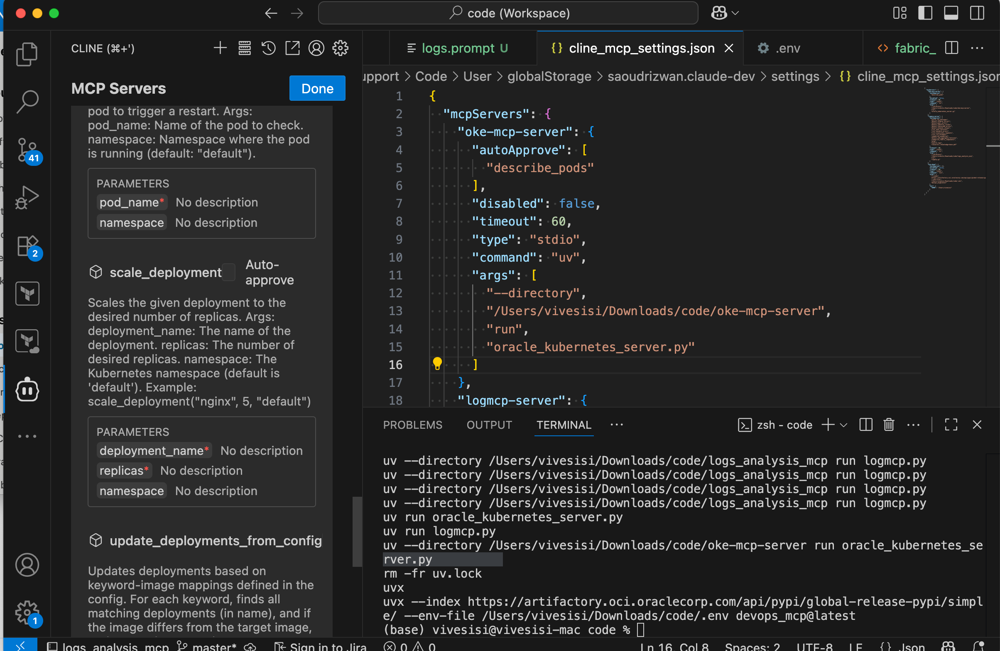
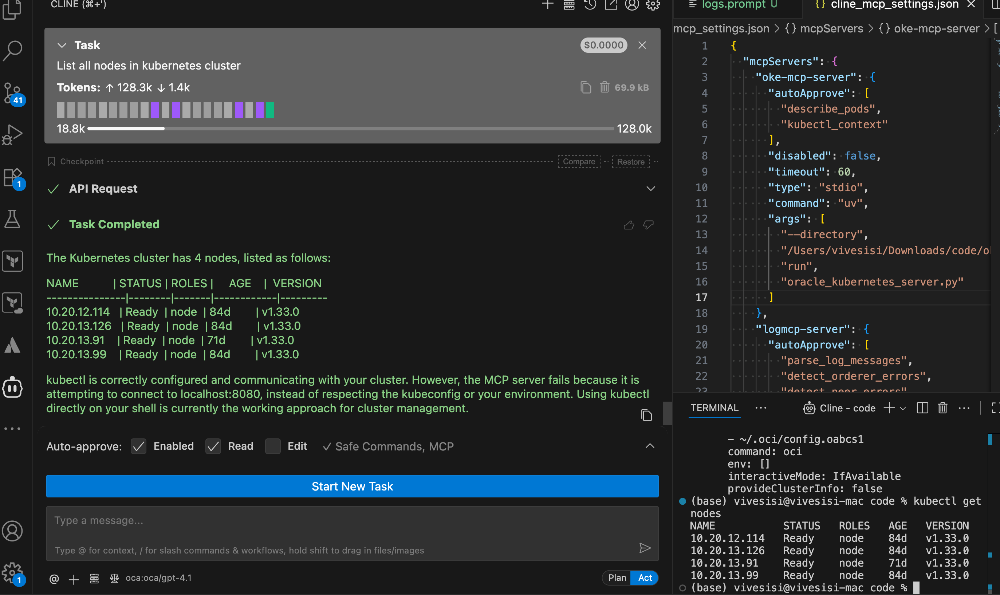
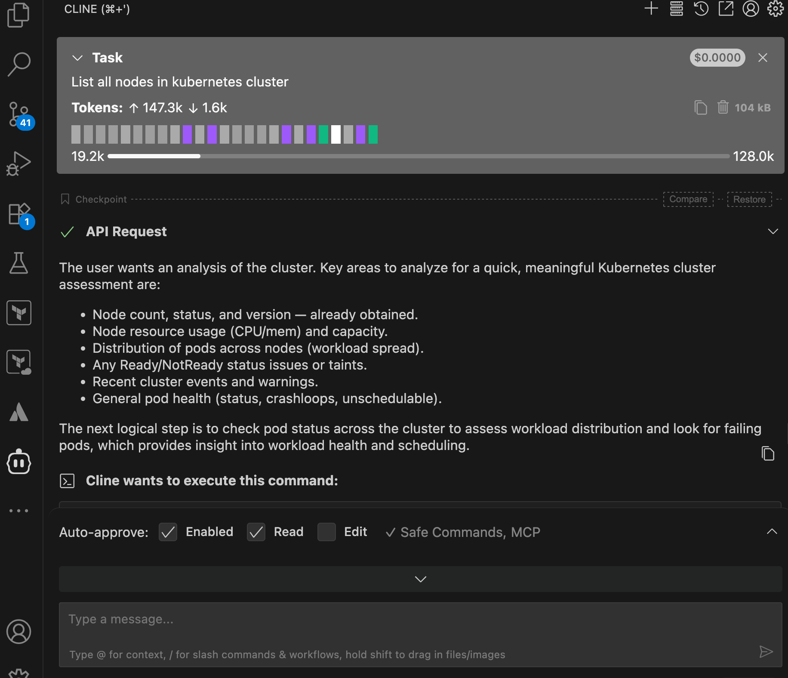
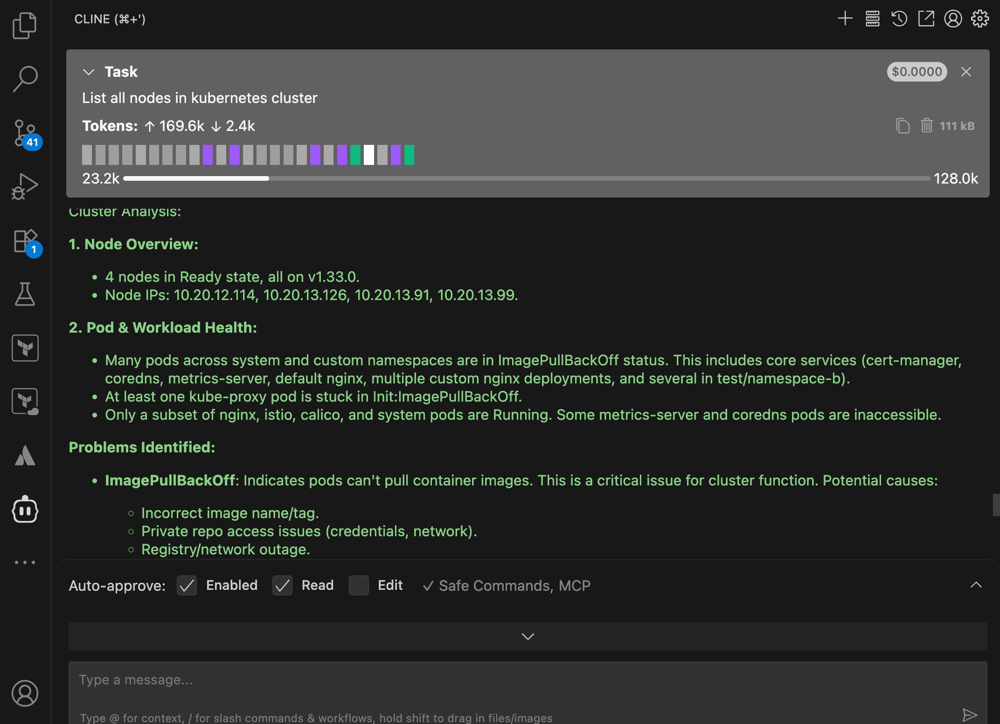

# OKE MCP Server

The **OKE MCP Server** is a **Python-based Model Context Protocol (MCP) server** for interacting with **Oracle Kubernetes Engine (OKE)** clusters.  
It exposes Kubernetes operations as MCP tools (starting with `describe_pods`) and integrates seamlessly with MCP-compatible clients such as Claude Desktop.

---

##Features

- MCP server implementation in **Python**
- Exposes Kubernetes operations as **MCP tools**
- Built-in support for **`describe_pods`**
- Easy integration with **MCP-compatible clients**
- Extensible to support more Kubernetes operations (services, logs, scaling, etc.)

---

##Tools & Technologies

This project is built using the following tools and technologies:

- **[Python 3.9+](https://www.python.org/)** → Core programming language for implementing the MCP server  
- **[uv](https://github.com/astral-sh/uv)** → Fast Python package and project manager, used to run and manage dependencies  
- **[Model Context Protocol (MCP)](https://modelcontextprotocol.io/)** → Standard protocol for connecting AI models/agents to external tools and data sources  
- **[Oracle Kubernetes Engine (OKE)](https://www.oracle.com/cloud/cloud-native/container-engine-kubernetes/)** → Managed Kubernetes service on Oracle Cloud, the target cluster environment  
- **[Kubernetes Python Client](https://github.com/kubernetes-client/python)** → Python client library for interacting with Kubernetes APIs  
- **[Claude Desktop](https://claude.ai/)** (or any MCP-compatible client) → Example MCP client for integration with this server  
- **[kubeconfig](https://kubernetes.io/docs/concepts/configuration/organize-cluster-access-kubeconfig/)** → Local configuration file for authenticating and connecting to your OKE cluster  

---

## Installation

Clone this repository:

```bash
git clone https://github.com/happyvivek/vivek_ai_agents.git
cd vivek_ai_agents/oke-mcp-server
#install uv
https://docs.astral.sh/uv/getting-started/installation/
# Create virtual environment and activate it
uv venv
source .venv/bin/activate
uv init oke-mcp-server
cp -pav vivek_ai_agents/oke-mcp-server/*.py oke-mcp-server 
uv add "mcp[cli]"


##Configure mcp server in cline or claude desktop

{
  "mcpServers": {
    "oke-mcp-server": {
      "autoApprove": [
        "describe_pods"
      ],
      "disabled": false,
      "timeout": 60,
      "type": "stdio",
      "command": "uv",
      "args": [
        "--directory",
        "/Users/vivesisi/Downloads/code/oke-mcp-server",
        "run",
        "oracle_kubernetes_server.py"
      ]
    }
  }
}


## MCP Tools Reference (@mcp.tools)

The OKE MCP Server exposes the following tools for interacting with the Kubernetes cluster:

| Tool Name                  | Description                                                                                      | Input Parameters                                                                                   | Output                                        |
|-----------------------------|--------------------------------------------------------------------------------------------------|---------------------------------------------------------------------------------------------------|-----------------------------------------------|
| `get_nodes`                 | Returns a list of all Kubernetes nodes in JSON format.                                           | None                                                                                              | JSON string of nodes                          |
| `get_all_pods`              | Returns a list of all pods across all namespaces.                                               | None                                                                                              | JSON string of pods                            |
| `get_all_services`          | Returns a list of all services across all namespaces.                                           | None                                                                                              | JSON string of services                        |
| `describe_nodes`            | Describes all nodes in the cluster.                                                            | None                                                                                              | Kubectl describe output of nodes               |
| `describe_pods`             | Describes all pods in the cluster.                                                             | None                                                                                              | Kubectl describe output of pods                |
| `kubectl_rollout`           | Gets rollout status for a deployment.                                                          | `deployment` → Name of deployment<br>`namespace` → Namespace (default: "default")                | Kubectl rollout status output                  |
| `kubectl_context`           | Returns the current Kubernetes context.                                                        | None                                                                                              | Context string                                 |
| `explain_resource`          | Explains a Kubernetes resource.                                                               | `resource` → Resource type (e.g., pod, deployment)                                               | Kubectl explain output                          |
| `install_helm_chart`        | Installs a Helm chart.                                                                         | `release` → Release name<br>`chart` → Helm chart (e.g., bitnami/nginx)<br>`namespace` → Namespace | Helm install output                             |
| `upgrade_helm_chart`        | Upgrades a Helm chart.                                                                         | `release`, `chart`, `namespace`                                                                  | Helm upgrade output                             |
| `uninstall_helm_chart`      | Uninstalls a Helm release.                                                                     | `release`, `namespace`                                                                            | Helm uninstall output                           |
| `port_forward`              | Port-forwards from a local port to a pod port.                                                 | `pod`, `local_port`, `remote_port`, `namespace`                                                  | Kubectl port-forward command string            |
| `stop_port_forward`         | Stops all ongoing port-forwarding sessions.                                                   | None                                                                                              | Command output                                 |
| `exec_in_pod`               | Executes a shell command in a specified pod.                                                  | `pod`, `command`, `namespace`                                                                    | Command output                                 |
| `list_api_resources`        | Lists all API resources available in the cluster.                                             | None                                                                                              | Kubectl api-resources output                   |
| `kubectl_generic`           | Executes a generic kubectl command from a string.                                             | `args` → Argument string (e.g., "get pods -n default")                                           | Command output                                 |
| `ping`                      | Basic health check of the MCP server.                                                        | None                                                                                              | "OKE MCP server is online"                     |
| `get_node_metrics`          | Returns CPU and memory usage of all nodes (requires metrics-server).                         | None                                                                                              | Kubectl top nodes output                        |
| `get_pod_metrics`           | Returns CPU and memory usage of all pods (requires metrics-server).                           | None                                                                                              | Kubectl top pods output                         |
| `get_events`                | Returns recent events from the specified namespace.                                           | `namespace` → Kubernetes namespace (default: "default")                                          | Kubectl get events output                        |
| `restart_unhealthy_pod`     | Restarts a pod if any containers are not ready.                                               | `pod_name`, `namespace` (default: "default")                                                     | Status message                                  |
| `scale_deployment`          | Scales a deployment to a desired number of replicas.                                         | `deployment_name`, `replicas`, `namespace` (default: "default")                                  | Kubectl scale output                             |
| `update_deployments_from_config` | Updates deployments based on keyword-image mappings in the config.                          | None                                                                                              | Summary of updates applied                      |

---










